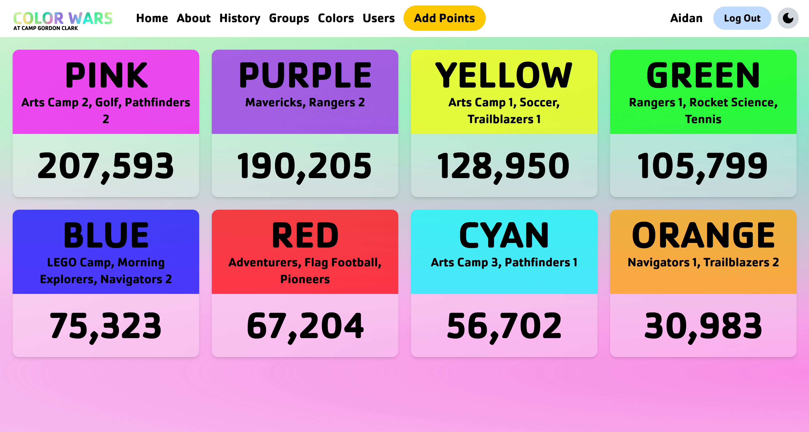
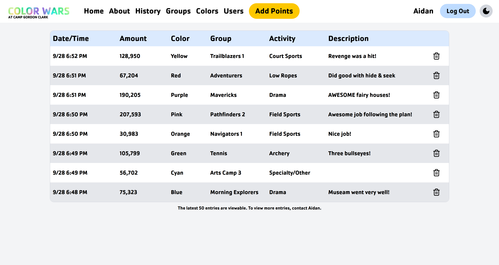
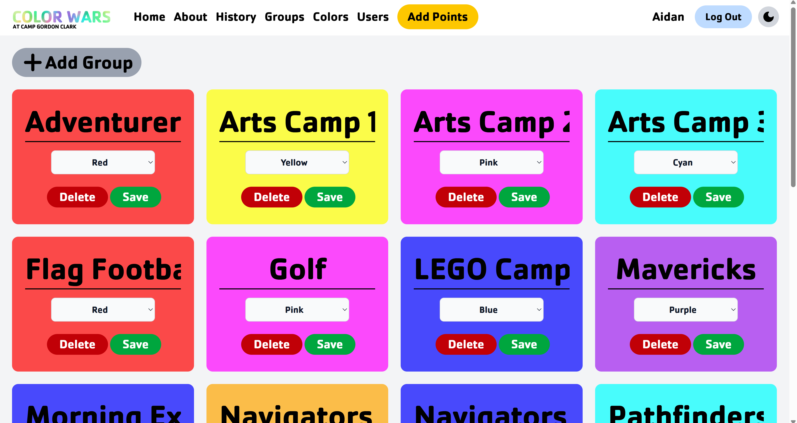
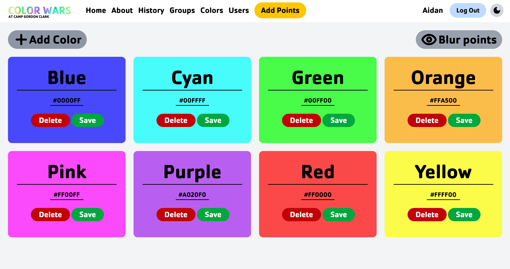
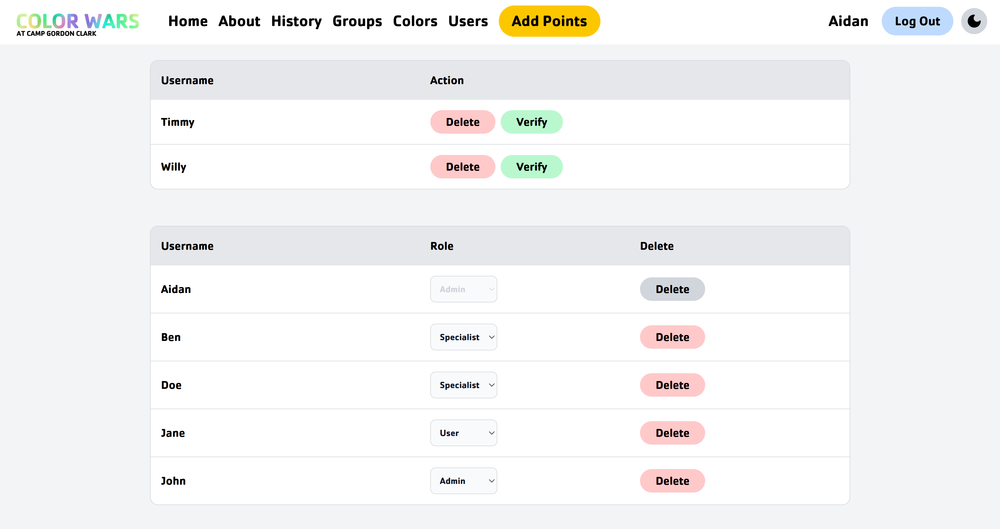
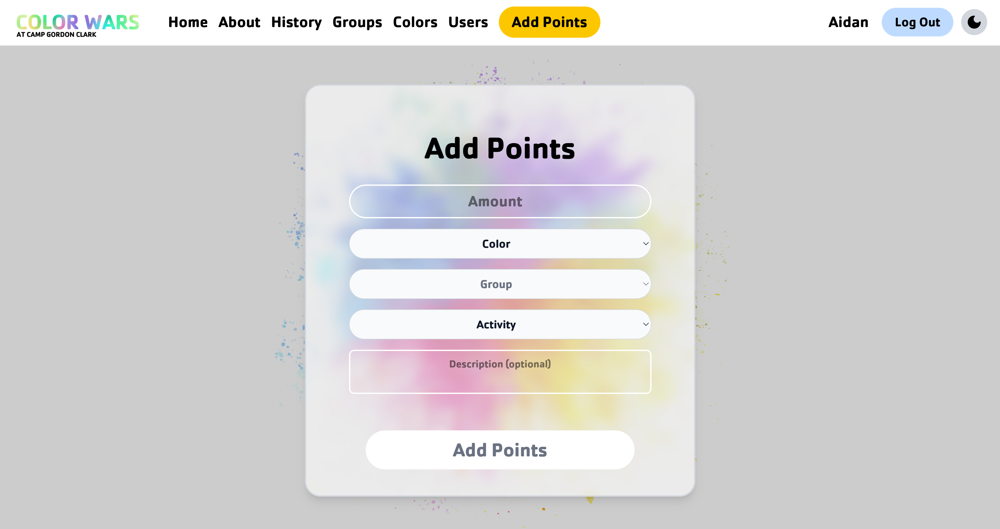
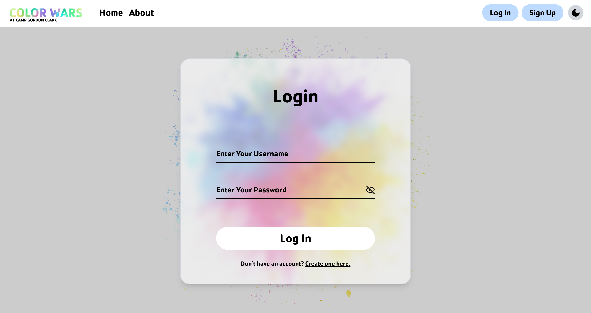
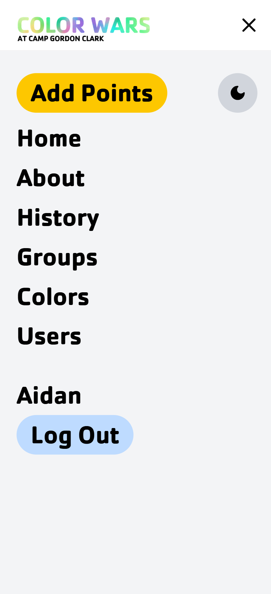

# Color Wars

This site was created to streamline and modernize the week of *Color Wars* at a summer camp I work at. During this week, groups are put together into teams where each team has a color. These teams then compete against each other in challenges throughout the day for points, and at the end of the week, the team with the most points wins. It's always been a blast, but managing the points coming in throughout camp was slow and manual, never mind displaying the points, which was done daily on boards on a field. So, I decided to create a website that would solve both the adding and viewing of points for camp.

## Migration

Prior to this codebase, this site was written in PHP. Due to newer and faster technologies being available (and me wanting to learn React/Next.js) this site has been fully re-written in JavaScript while keeping the same format as the old version.

## User Roles & Permissions

- User:
  - View points history
- Specialist:
  - *All the above*
  - Verify accounts to *user* role
- Administrator:
  - *All the above*
  - Add points to groups
  - Add, edit, and remove groups
  - Add, edit, and remove teams
  - Modify user permissions

## Technologies Used

- Next.js
- React
- Supabase (db hosting)
- Vercel (hosting)
- Prisma
- next-themes
- Lucide
- Auth.js
- Zod
- bcrypt

# Images
*All images contain only test data*

Home Page
 
 

History Page
 
 

Groups Page
 
 

Colors Page
 
 

Users Page
 
 

Adding Points
 
 

Logging In
 
 

Mobile Navbar

